# So Sánh & Phân Biệt Các Loại Routing trong Next.js

Dự án minh họa trực quan, chạy được thật, cho 6 khái niệm hay gặp khi học
routing trong Next.js: **Parallel, Imperative, Redirecting, Shallow, Nested,
Dynamic Routing**. Xây dựng bằng Next.js 16 (App Router) kết hợp Pages Router
cho riêng phần Shallow Routing.

> Đã build và chạy thử thành công với **Next.js 16.3.1 / React 19.2.8 / Node.js 22**.

---

## 1. Nhận định quan trọng trước khi bắt đầu

6 khái niệm trong đề bài **không ngang hàng nhau** — chúng thuộc 3 nhóm bản
chất khác nhau. Hiểu rõ điều này là chìa khóa để không nhầm lẫn:

| Nhóm | Gồm những loại nào | Bản chất |
|---|---|---|
| **A. Quy ước cấu trúc thư mục**<br>(định nghĩa route nào *tồn tại*) | Parallel, Nested, Dynamic | Đặt tên thư mục/file theo quy ước (`@slot`, `[param]`, lồng cấp) để Next.js tự sinh ra route và layout tương ứng. |
| **B. Kỹ thuật điều hướng**<br>(cách *bạn* chủ động chuyển trang) | Imperative (đối lập với Declarative) | Gọi hàm `router.push()` trong code, thay vì khai báo sẵn `<Link href="...">` trong JSX. |
| **C. Hành vi xảy ra khi điều hướng**<br>(điều gì xảy ra *sau khi* URL đổi) | Redirecting, Shallow | Redirecting = tự động đưa người dùng sang URL khác. Shallow = đổi URL nhưng không chạy lại việc lấy dữ liệu. |

Vì vậy tài liệu này không so sánh "6 tính năng cùng loại", mà giải thích rõ
từng khái niệm thuộc nhóm nào và giải quyết vấn đề gì.

---

## 2. Yêu cầu môi trường

- Node.js **>= 20** (bắt buộc với Next.js 16; dự án đã test với Node 22)
- npm >= 10

## 3. Cài đặt & chạy dự án

```bash
npm install
npm run dev
```

Mở `http://localhost:3000`. Trang chủ có menu dẫn tới demo của cả 6 loại.

Build kiểm tra production (đã chạy thử, không lỗi):

```bash
npm run build
npm run start
```

## 4. Cấu trúc thư mục

```
nextjs-routing-comparison/
├── app/                              # App Router (Next.js 13+)
│   ├── layout.js                     # Layout gốc, chứa thanh điều hướng chung
│   ├── page.js                       # Trang chủ
│   ├── globals.css
│   ├── parallel-routing/
│   │   ├── layout.js                 # Nhận 3 slot: children, team, analytics
│   │   ├── page.js                   # Slot mặc định
│   │   ├── @team/{page,default}.js   # Slot song song #1
│   │   └── @analytics/{page,default}.js  # Slot song song #2
│   ├── imperative-routing/
│   │   └── page.js                   # Client Component dùng useRouter()
│   ├── redirecting-routing/
│   │   ├── page.js                   # Trang tổng quan 3 cơ chế redirect
│   │   ├── server-redirect/page.js   # Cơ chế 1: redirect()
│   │   ├── proxy-demo/page.js        # Cơ chế 3: bị proxy.js redirect có điều kiện
│   │   └── target/page.js            # Trang đích chung
│   ├── nested-routing/
│   │   ├── layout.js                 # Layout lồng cấp 1
│   │   ├── page.js
│   │   └── settings/
│   │       ├── layout.js             # Layout lồng cấp 2
│   │       ├── page.js
│   │       ├── profile/page.js
│   │       └── security/page.js
│   └── dynamic-routing/
│       ├── page.js
│       ├── [productId]/page.js       # Dynamic segment
│       └── category/[...slug]/page.js # Catch-all route
├── pages/                            # Pages Router (chỉ dùng cho Shallow Routing)
│   └── shallow-routing-demo.js
├── proxy.js                          # Cơ chế 3 của redirect (tên mới của middleware.js từ Next.js 16)
├── next.config.mjs                   # Cơ chế 2 của redirect (redirects() tĩnh)
├── package.json
└── README.md
```

> **Vì sao dự án có cả `app/` lẫn `pages/`?** Next.js cho phép 2 hệ thống
> này cùng tồn tại (dùng khi migrate dần từ Pages Router sang App Router).
> Ở đây tận dụng điều đó để demo Shallow Routing **đúng với API gốc** của
> nó — vì `{ shallow: true }` là tuỳ chọn chính thức chỉ có ở Pages Router
> (xem mục 5.6).

---

## 5. Chi tiết từng loại Routing
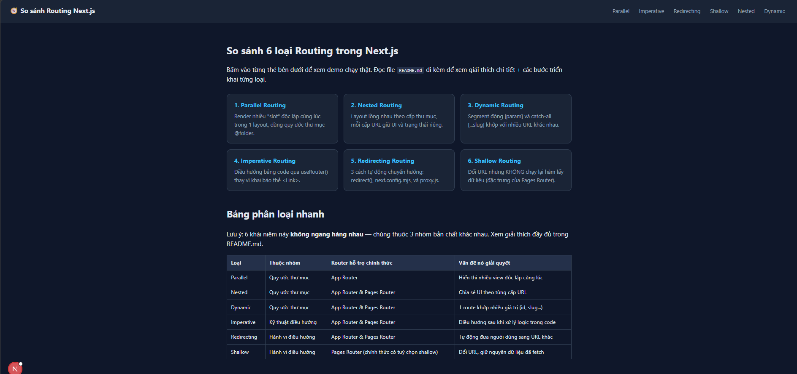

### 5.1 Parallel Routing
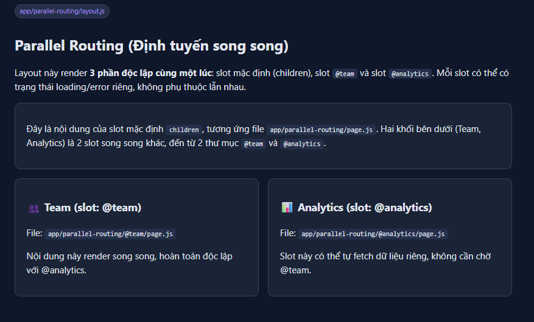

**Khái niệm:** Render nhiều trang/khu vực (gọi là "slot") **cùng lúc, độc
lập với nhau**, trong cùng một layout — dùng quy ước thư mục bắt đầu bằng
`@`.

**Các bước thực hiện:**
1. Tạo `app/parallel-routing/layout.js`, khai báo hàm nhận các prop tương
   ứng tên slot: `{ children, team, analytics }`.
   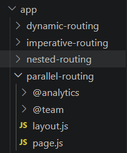
2. Tạo 2 thư mục con **bắt đầu bằng `@`**: `@team/` và `@analytics/` — tên
   sau dấu `@` phải khớp chính xác tên prop ở bước 1.
   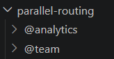
3. Trong mỗi thư mục slot, tạo `page.js` chứa UI riêng của slot đó.
   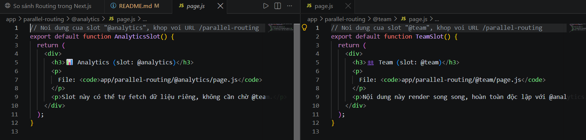
4. Thêm `default.js` trong mỗi slot làm giao diện dự phòng (fallback) —
   Next.js cần file này để tránh lỗi 404 khi không thể khôi phục trạng thái
   của slot lúc tải lại trang.
   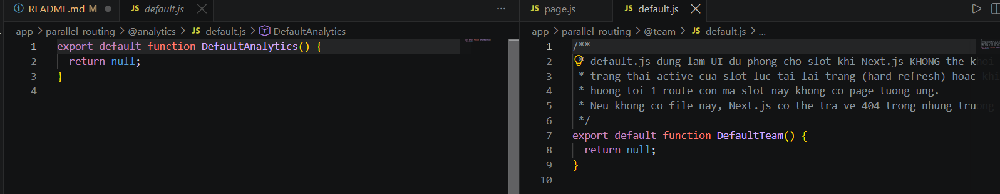
5. Trong `layout.js`, render cả 3 phần trong cùng cây JSX — chúng xuất hiện
   đồng thời trong 1 lần render server.
   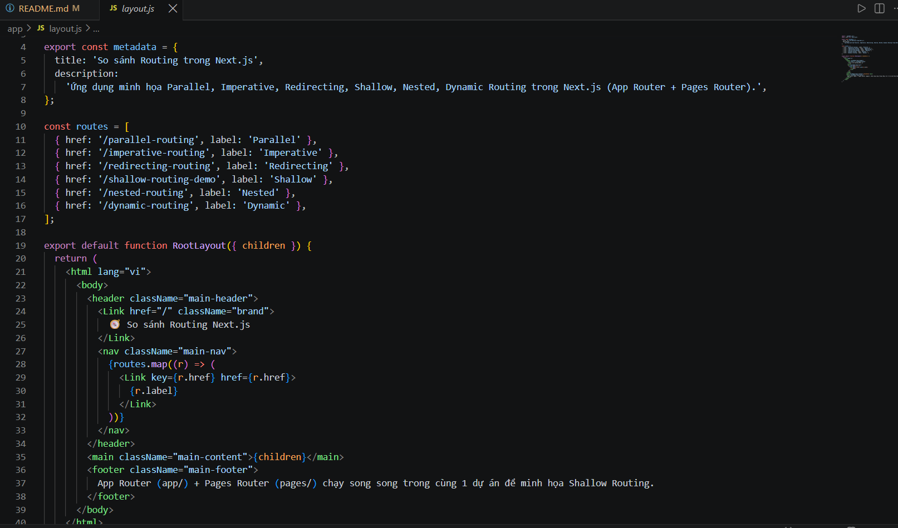
   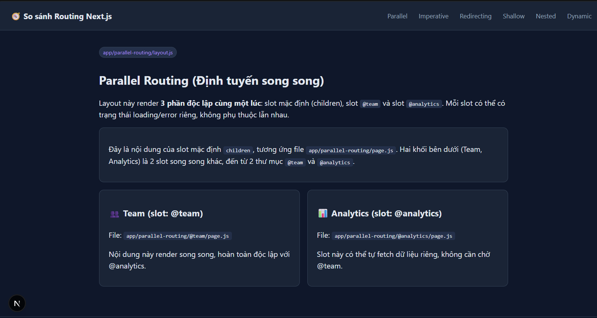


**Code lõi (`app/parallel-routing/layout.js`):**
```jsx
export default function ParallelRoutingLayout({ children, team, analytics }) {
  return (
    <div>
      <div>{children}</div>
      <div className="parallel-grid">
        <div>{team}</div>
        <div>{analytics}</div>
      </div>
    </div>
  );
}
```

**Cách kiểm chứng:** Vào `/parallel-routing` — cả 3 khối nội dung (mặc định,
Team, Analytics) xuất hiện cùng lúc dù đến từ 3 file `page.js` khác nhau.

**Ứng dụng thực tế:** Dashboard nhiều widget độc lập (mỗi widget tự
loading/error riêng), hoặc màn hình có modal/slide-over hiển thị song song
với nội dung chính.

---

### 5.2 Nested Routing
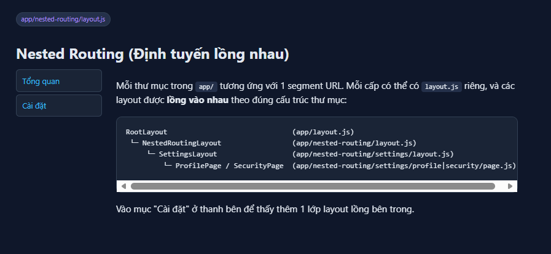

**Khái niệm:** Mỗi thư mục trong `app/` ứng với 1 segment URL; mỗi cấp có
thể có `layout.js` riêng, và các layout **lồng vào nhau** đúng theo cấu
trúc thư mục — layout cha luôn bao layout con.

**Các bước thực hiện:**
1. Tạo `app/nested-routing/layout.js` — layout cấp 1, chứa thanh điều
   hướng phụ.
   
2. Tạo `app/nested-routing/page.js` — nội dung trang tổng quan.
   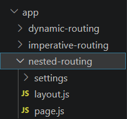
3. Tạo thư mục con `settings/` với `layout.js` riêng — layout cấp 2, chỉ
   bao các trang bên trong `settings/`.
   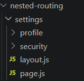
4. Tạo tiếp 2 thư mục con `settings/profile/` và `settings/security/`, mỗi
   thư mục 1 `page.js`.
   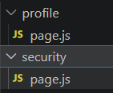
5. Kết quả: `RootLayout → NestedRoutingLayout → SettingsLayout → ProfilePage`
   — 3 lớp layout lồng nhau khi vào `/nested-routing/settings/profile`.
   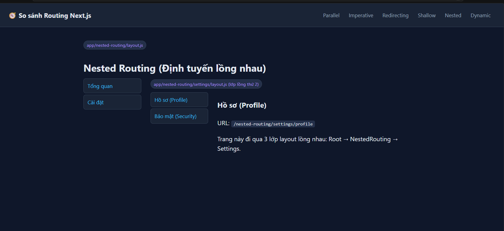

**Code lõi (`app/nested-routing/settings/layout.js`):**
```jsx
export default function SettingsLayout({ children }) {
  return (
    <div className="settings-shell">
      <aside>{/* menu phụ */}</aside>
      <div>{children}</div>
    </div>
  );
}
```

**Cách kiểm chứng:** Chuyển qua lại giữa "Hồ sơ" và "Bảo mật" trong
`/nested-routing/settings/*` — phần khung `SettingsLayout` (thanh bên)
**không bị render lại**, chỉ nội dung con thay đổi.

**Ứng dụng thực tế:** Trang cài đặt nhiều tab, khu vực quản trị có sidebar
cố định, hệ thống layout theo cấp (ví dụ: layout công ty → layout phòng
ban → layout nhân viên).

---

### 5.3 Dynamic Routing


**Khái niệm:** Đặt tên thư mục/file trong dấu ngoặc vuông để tạo ra segment
**động**, khớp với bất kỳ giá trị nào tại vị trí đó trong URL.

**Các bước thực hiện:**
1. Tạo thư mục `app/dynamic-routing/[productId]/page.js` — dấu ngoặc vuông
   báo cho Next.js đây là segment động, tên `productId` là tên biến sẽ nhận
   được.
   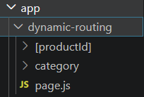
2. Trong component, khai báo prop `params` — **từ Next.js 15 trở đi, `params`
   là một Promise**, phải `await` trước khi đọc.
   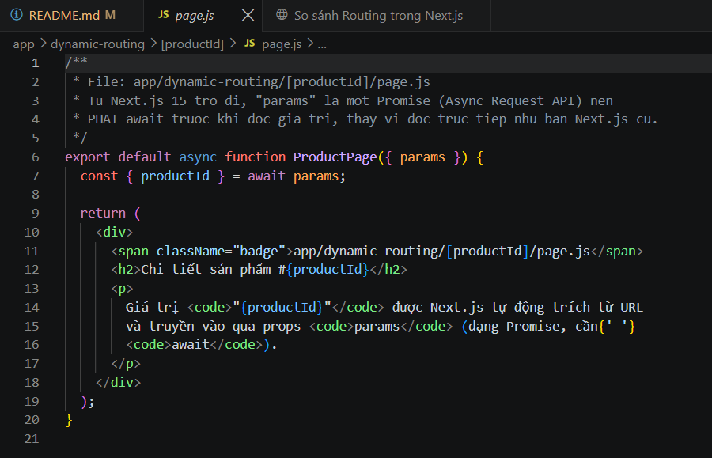
3. (Mở rộng) Tạo `app/dynamic-routing/category/[...slug]/page.js` — 3 dấu
   chấm phía trước tên biến tạo ra **Catch-all Route**, khớp với nhiều
   segment liên tiếp cùng lúc (ví dụ `/category/a/b/c` → `slug = ['a','b','c']`).
   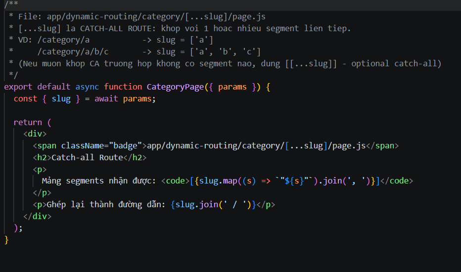

**Code lõi (`app/dynamic-routing/[productId]/page.js`):**
```jsx
export default async function ProductPage({ params }) {
  const { productId } = await params; // Next.js 15+: params là Promise
  return <h2>Chi tiết sản phẩm #{productId}</h2>;
}
```

**Cách kiểm chứng:** Vào `/dynamic-routing/1`, `/dynamic-routing/42`,... —
cùng 1 file code phục vụ vô số URL khác nhau. Vào
`/dynamic-routing/category/dien-tu/laptop/gaming` để thấy catch-all route
nhận mảng 3 phần tử.

**Ứng dụng thực tế:** Trang chi tiết sản phẩm/bài viết theo id hoặc slug,
trang danh mục nhiều cấp (breadcrumb động).

---

### 5.4 Imperative Routing
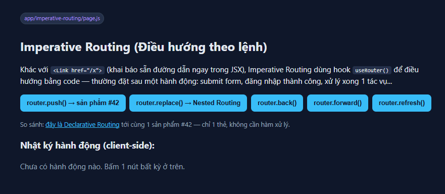

**Khái niệm:** Điều hướng **bằng code** (gọi hàm trong sự kiện/logic), đối
lập với **Declarative Routing** (khai báo sẵn đường dẫn bằng thẻ
`<Link href="...">` trong JSX). Đây không phải là một quy ước thư mục, mà
là kỹ thuật viết code điều hướng.

**Các bước thực hiện:**
1. Tạo `app/imperative-routing/page.js`, thêm dòng đầu tiên `'use client'`
   — bắt buộc vì hook điều hướng và sự kiện `onClick` chỉ chạy được trong
   Client Component.
   
2. Import hook `useRouter` từ `next/navigation` (App Router — **khác** với
   `next/router` của Pages Router).
   
3. Gọi `const router = useRouter()`, rồi dùng trong các trình xử lý sự
   kiện: `router.push()`, `router.replace()`, `router.back()`,
   `router.forward()`, `router.refresh()`.
   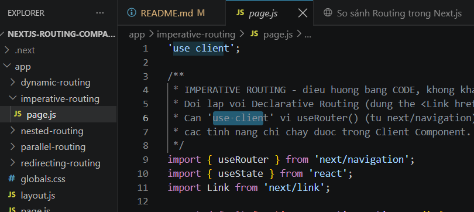

**Code lõi:**
```jsx
'use client';
import { useRouter } from 'next/navigation';

export default function Page() {
  const router = useRouter();
  return (
    <button onClick={() => router.push('/dynamic-routing/42')}>
      Đi tới sản phẩm #42
    </button>
  );
}
```

**Cách kiểm chứng:** Vào `/imperative-routing`, bấm các nút — mỗi nút gọi 1
phương thức khác nhau của `router`, có nhật ký hành động hiển thị bên dưới.
So sánh với liên kết `<Link>` ngay trên trang: cùng đích đến, nhưng
`<Link>` không cần hàm xử lý.

**Ứng dụng thực tế:** Điều hướng sau khi submit form thành công, sau khi
đăng nhập, sau khi 1 tác vụ bất đồng bộ hoàn tất — những lúc **không** có
sẵn 1 thẻ bấm để gắn `href`.

---

### 5.5 Redirecting Routing
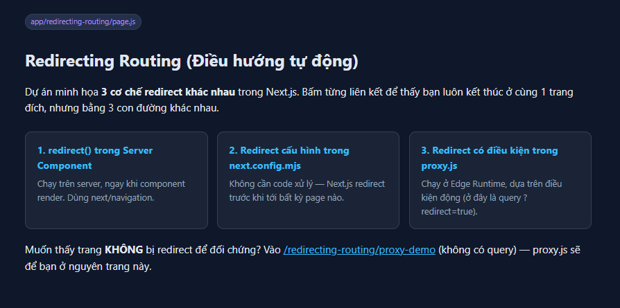

**Khái niệm:** Tự động đưa người dùng từ URL này sang URL khác. Next.js có
**3 cơ chế** độc lập, dự án minh họa cả 3.

**Các bước thực hiện:**

**Cơ chế 1 — `redirect()` trong Server Component:**
1. Tạo `app/redirecting-routing/server-redirect/page.js`.
   
2. Import `redirect` từ `next/navigation`, gọi `redirect('/duong-dan-dich')`
   ngay trong thân component (không đặt trong `try/catch` bao quanh nó).
   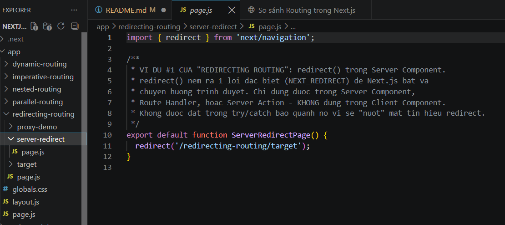
3. Hàm này ném ra một lỗi đặc biệt (`NEXT_REDIRECT`) mà Next.js tự bắt và
   chuyển hướng — chỉ dùng được trong Server Component / Route Handler /
   Server Action.

```jsx
import { redirect } from 'next/navigation';
export default function Page() {
  redirect('/redirecting-routing/target');
}
```

**Cơ chế 2 — Redirect tĩnh trong `next.config.mjs`:**
1. Mở `next.config.mjs`, thêm hàm `async redirects()` trả về mảng quy tắc
   `{ source, destination, permanent }`.
   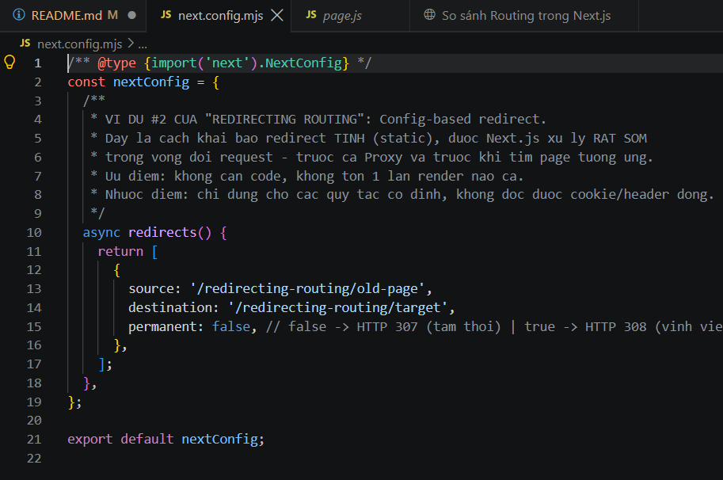
2. `permanent: false` → HTTP 307 (tạm thời); `permanent: true` → HTTP 308
   (vĩnh viễn, trình duyệt sẽ nhớ lâu dài).
   
3. Không cần tạo `page.js` cho `source` — Next.js chặn và chuyển hướng
   **trước khi** tìm route tương ứng.

```js
async redirects() {
  return [{ source: '/old-page', destination: '/target', permanent: false }];
}
```

**Cơ chế 3 — Redirect có điều kiện trong `proxy.js`:**
1. Tạo file `proxy.js` **ở thư mục gốc dự án** (ngang hàng `package.json`).

2. Import `NextResponse` từ `next/server`, viết hàm `export function proxy(request) {...}`.
   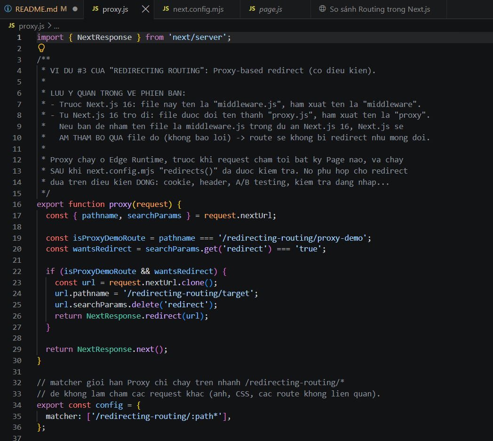
3. Đọc `request.nextUrl` (pathname, searchParams, cookies...) để quyết định
   điều kiện, trả về `NextResponse.redirect(url)` hoặc `NextResponse.next()`
   (đi tiếp bình thường).
   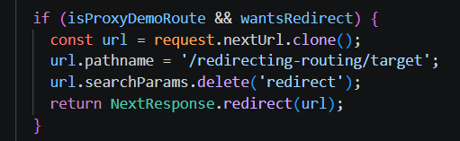
4. Xuất thêm `export const config = { matcher: [...] }` để giới hạn phạm
   vi các route mà proxy chạy trên đó (tránh chặn mọi request kể cả ảnh, CSS).
   

```js
import { NextResponse } from 'next/server';
export function proxy(request) {
  const { pathname, searchParams } = request.nextUrl;
  if (pathname === '/proxy-demo' && searchParams.get('redirect') === 'true') {
    return NextResponse.redirect(new URL('/target', request.url));
  }
  return NextResponse.next();
}
export const config = { matcher: ['/redirecting-routing/:path*'] };
```

> ⚠️ **Lưu ý phiên bản quan trọng:** Trước Next.js 16, cơ chế này dùng file
> tên `middleware.js` với hàm xuất tên `middleware`. **Từ Next.js 16 trở
> đi, quy ước đổi tên thành `proxy.js` / hàm `proxy`.** Nếu để nhầm tên cũ
> `middleware.js` trong dự án Next.js 16, Next.js sẽ **âm thầm bỏ qua file
> đó, không báo lỗi gì** — khiến logic redirect/bảo vệ route ngừng hoạt
> động mà không rõ nguyên nhân. Dự án này đã cập nhật đúng theo quy ước mới.

**Thứ tự xử lý:** `next.config.mjs` redirects → `proxy.js` → route thực
tế. Vì vậy 2 cơ chế không xung đột nhau dù có thể cùng áp dụng lên 1 nhánh
URL.

**Cách kiểm chứng:** Vào `/redirecting-routing`, thử cả 3 liên kết — mở dev
tools tab Network sẽ thấy 2 mã trạng thái khác nhau (`307`/`308`) tuỳ cấu
hình, đều dẫn về cùng trang đích.

**Ứng dụng thực tế:** Đổi URL sản phẩm/bài viết cũ (SEO), yêu cầu đăng nhập
trước khi vào trang riêng tư, A/B testing theo cookie.

---

### 5.6 Shallow Routing
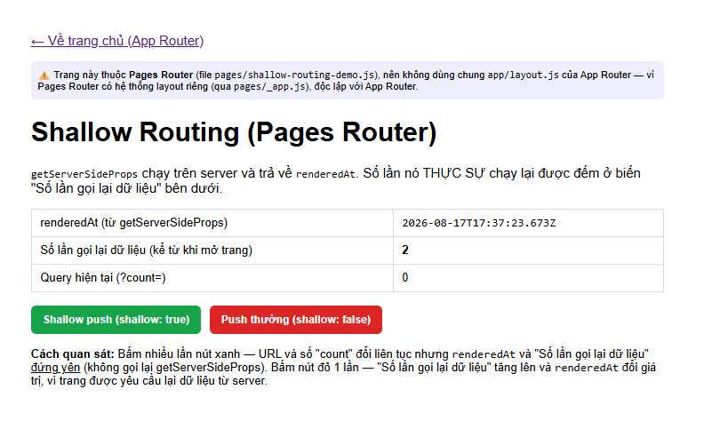

**Khái niệm:** Đổi URL trên thanh địa chỉ (và cập nhật `router.query`)
**nhưng không chạy lại hàm lấy dữ liệu** (`getServerSideProps` /
`getStaticProps`). Đây là tuỳ chọn **chính thức chỉ tồn tại ở Pages
Router** — App Router (thư mục `app/`) hiện **không có** cờ `shallow`
tương đương, vì Server Component có vòng đời dữ liệu khác hẳn (không có
khái niệm "hàm fetch dữ liệu của trang" tách rời như Pages Router).

**Các bước thực hiện:**
1. Tạo file `pages/shallow-routing-demo.js` (Pages Router, không phải App
   Router — không có dòng `'use client'`, vì khái niệm Server/Client
   Component chỉ tồn tại ở App Router).
   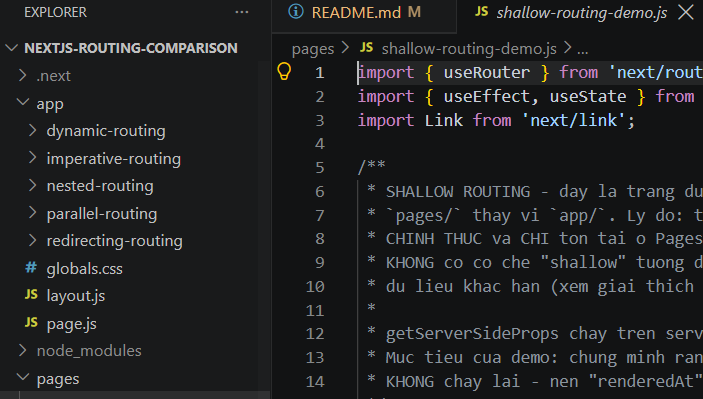
2. Viết hàm `getServerSideProps` trả về dữ liệu kèm mốc thời gian
   (`renderedAt`) để quan sát khi nào nó thực sự chạy lại.
   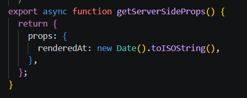
3. Trong component, dùng `useRouter()` từ **`next/router`** (khác
   `next/navigation` của App Router).
   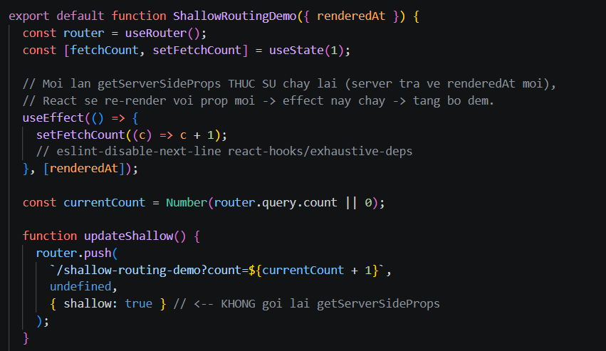
4. Viết 2 hàm cập nhật URL:
   - `router.push(url, undefined, { shallow: true })` → đổi URL, **không**
     gọi lại `getServerSideProps`.
     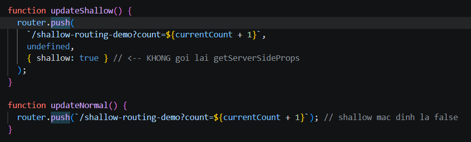
   - `router.push(url)` (mặc định `shallow: false`) → đổi URL **và** gọi
     lại `getServerSideProps`.
     
```js
export async function getServerSideProps() {
  return { props: { renderedAt: new Date().toISOString() } };
}

export default function Page({ renderedAt }) {
  const router = useRouter();
  const shallowUpdate = () =>
    router.push(`/shallow-routing-demo?count=1`, undefined, { shallow: true });
  const normalUpdate = () => router.push(`/shallow-routing-demo?count=1`);
  // ...
}
```

**Cách kiểm chứng:** Vào `/shallow-routing-demo`, bấm nút "Shallow push"
nhiều lần — URL và `router.query.count` đổi liên tục nhưng `renderedAt` và
bộ đếm "số lần gọi lại dữ liệu" **đứng yên**. Bấm nút "Push thường" — cả
hai giá trị đó **thay đổi ngay**.

**App Router có gì tương đương?** Không có cờ `shallow` chính thức, nhưng
từ Next.js 14.1 có thể tự cập nhật thanh địa chỉ mà không kích hoạt điều
hướng của Next.js, bằng cách gọi thẳng History API của trình duyệt:
```js
window.history.pushState(null, '', `${pathname}?tab=${tab}`);
```
Cách này cập nhật URL "thủ công", tương tác được với `useSearchParams()`,
nhưng không đi qua bộ điều hướng của Next.js nên không có khái niệm
"gọi lại data fetching" giống Pages Router (Server Component tự quyết định
render lại theo cơ chế cache/revalidate riêng).

**Ứng dụng thực tế:** Lưu trạng thái filter/tab/trang hiện tại vào URL
(để chia sẻ link, back/forward hoạt động đúng) mà không phải tải lại toàn
bộ dữ liệu trang mỗi lần đổi filter.

---

## 6. Bảng so sánh tổng hợp

| Loại | Nhóm | File/quy ước chính | Router hỗ trợ | Hàm/API chính |
|---|---|---|---|---|
| Parallel | A. Cấu trúc thư mục | `@slot/page.js` | App Router | props `children`, `[tênSlot]` trong layout |
| Nested | A. Cấu trúc thư mục | `layout.js` theo cấp | App & Pages Router | Lồng thư mục |
| Dynamic | A. Cấu trúc thư mục | `[param]`, `[...slug]` | App & Pages Router | `params` (Promise ở App Router từ bản 15+) |
| Imperative | B. Kỹ thuật điều hướng | không có file riêng | App & Pages Router | `useRouter()` (`next/navigation` hoặc `next/router`) |
| Redirecting | C. Hành vi điều hướng | `redirect()`, `next.config.mjs`, `proxy.js` | App & Pages Router | `redirect()`, `redirects()`, `NextResponse.redirect()` |
| Shallow | C. Hành vi điều hướng | — | **Chỉ chính thức ở Pages Router** | `router.push(url, undefined, { shallow: true })` |

---

## 7. Các bước đã thực hiện để xây dựng toàn bộ dự án

1. Khởi tạo `package.json` thủ công với `next@16`, `react@19`, `react-dom@19`.
2. Tạo `next.config.mjs` khai báo redirect tĩnh (`redirects()`).
3. Tạo `proxy.js` ở thư mục gốc cho redirect có điều kiện (theo đúng quy
   ước Next.js 16, không phải `middleware.js`).
4. Dựng `app/layout.js` (layout gốc + thanh điều hướng) và `app/page.js`
   (trang chủ tổng hợp, có bảng so sánh).
5. Lần lượt tạo 6 thư mục con trong `app/` cho Parallel, Imperative,
   Redirecting, Nested, Dynamic Routing theo các bước mô tả ở mục 5.
6. Tạo riêng `pages/shallow-routing-demo.js` ở Pages Router cho Shallow
   Routing, vì đây là API không tồn tại ở App Router.
7. Viết `app/globals.css` cho giao diện chung.
8. Chạy `npm install`, sau đó `npm run build` để kiểm tra lỗi biên dịch —
   build thành công, tạo ra 15 route App Router + 1 route Pages Router + 1
   Proxy, không có lỗi.
9. Chạy `npm run start` và dùng `curl` kiểm tra runtime thực tế: mã trạng
   thái HTTP của 3 cơ chế redirect (307 kèm header `Location` đúng), giá
   trị `params` trong dynamic route, cả 3 slot của parallel route cùng
   xuất hiện trong 1 lần tải trang.
10. Viết tài liệu README.md này.

---

## 8. Tài liệu tham khảo

- Next.js Docs — Parallel Routes: `nextjs.org/docs/app/api-reference/file-conventions/parallel-routes`
- Next.js Docs — Dynamic Routes: `nextjs.org/docs/app/api-reference/file-conventions/dynamic-routes`
- Next.js Docs — Redirecting Guide: `nextjs.org/docs/app/guides/redirecting`
- Next.js Docs — Proxy (đổi tên từ Middleware ở bản 16): `nextjs.org/docs/app/api-reference/file-conventions/proxy`
- Next.js Docs (Pages Router) — Shallow Routing: `nextjs.org/docs/pages/building-your-application/routing/linking-and-navigating#shallow-routing`
